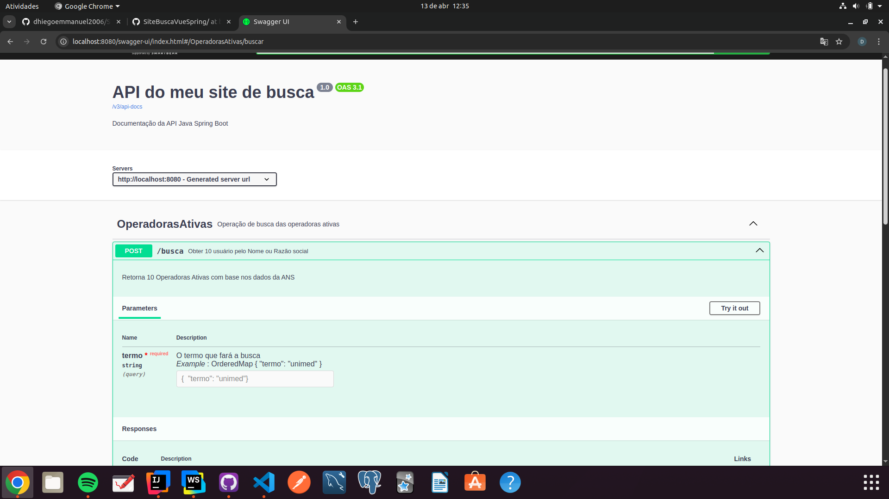
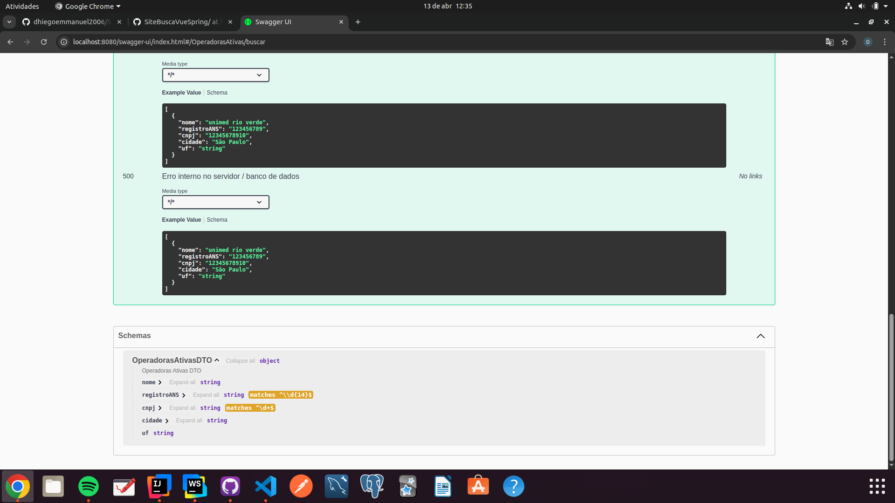

# ANS Operadoras API

API de consulta de operadoras ativas registradas na Agência Nacional de Saúde Suplementar (ANS).  
Este projeto utiliza **Spring Boot 3.4.4** para fornecer endpoints que retornam dados de operadoras de planos de saúde.

## 📌 Tecnologias Utilizadas

- **Java** (versão 17 ou superior)
- **Spring Boot 3.4.4** (Spring Web, Spring Data JPA)
- **MySQL** (Banco de dados)
- **Lombok** (Para reduzir boilerplate code)
- **Spring Doc OpenAPI** (Documentação da API)
- **Postman** (Testes de requisições)

## Imagens do swagger

